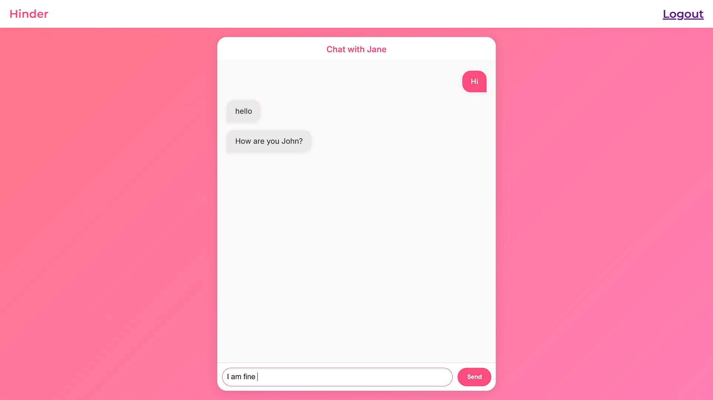
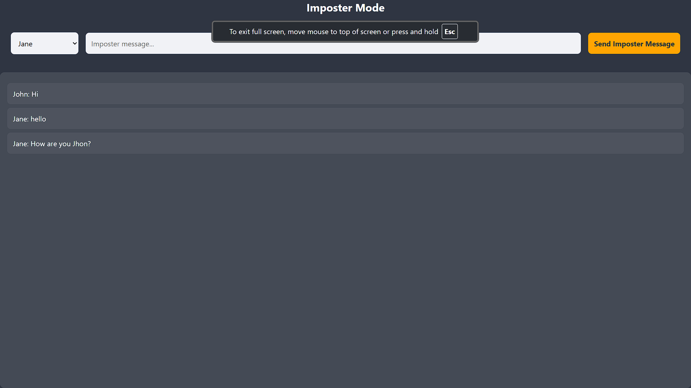

# Hinder 🎯

## Basic Details
### Team Name: Bicentennial

### Team Members
- Team Lead: Adarsh Saju - College of Engineering, Trivandrum
- Member 2: N N Balaji - College of Engineering, Trivandrum
- Member 3: Gowtham R Nair - College of Engineering, Trivandrum

### Project Description
Hinder is a tongue-in-cheek messaging app designed to sabotage smooth conversations, particularly on dating platforms, by crafting awkward or odd responses that mimic the user's style. The app uses advanced AI to inject random, bizarre, and out-of-context responses into chat threads, introducing a layer of confusion and hilarity. Additionally, it features an "imposter" mode, allowing a third party to temporarily impersonate one of the chat participants, blending seamlessly into the conversation without anyone catching on. Whether you’re aiming for mischief or merely experimenting with unconventional social interactions, Hinder ensures no conversation ever goes as planned!

### The Problem (that doesn't exist)
Dating apps make it too easy for relationships to form and flourish. *Hinder* steps in to change that by sabotaging conversations with awkward or weird messages that can lead to misunderstandings and, ultimately, breakups. It’s designed for those who want to disrupt budding relationships or add chaos to interactions, making it harder for any real connection to survive.

### The Solution (that nobody asked for)
 
*Hinder* is like your mischievous sidekick for wrecking romance! By jumping into your chats and sending random, cringeworthy messages, it creates moments that are hilariously awkward—and almost impossible to recover from. Whether it's a bizarre confession, an out-of-place joke, or a slightly too intense question, *Hinder* keeps the conversation spiraling out of control.

With the "imposter" feature, *Hinder* lets a friend join the chaos by secretly impersonating one of the chat participants, throwing everyone off balance. It’s sabotage as a service—because not every match is meant to last!

## Technical Details
### Technologies/Components Used
For Software:
- Python,JavaScript,HTML,CSS
- Flask
- genai
- Google AI Studio

### Implementation
For Software:
# Run
Website link(doesnt work):-https://hinder-a12e80597ccd.herokuapp.com/

### Project Documentation
For Software:
Login credentials for the user Profiles
- Username : John
- Password : password123
- Username : Jane
- Password : mypassword
  
Login credential for Imposter Account
- Imposter : imposterpassword
# Screenshots (Add at least 3)

  
  
     

### Project Demo

# Video
https://drive.google.com/file/d/1sXDrav1vS8aASgmumm5b2j0jjd-io99i/view?usp=sharing
*Explain what the video demonstrates*
Video shows a basic use case of our solution.
# Additional Demos
[Add any extra demo materials/links]

## Team Contributions
- Adarsh Saju : Frotend and Backend
- N N Balaji : Backend
- Gowtham R Nair : AI

---
Made with ❤️ at TinkerHub Useless Projects 

